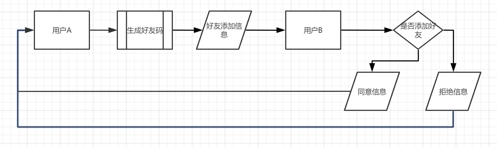
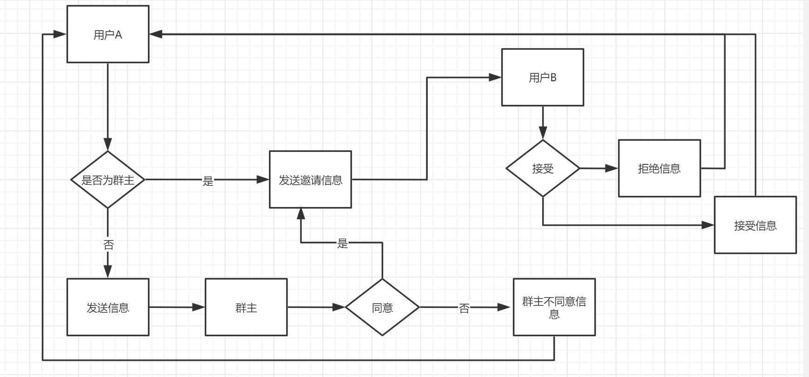
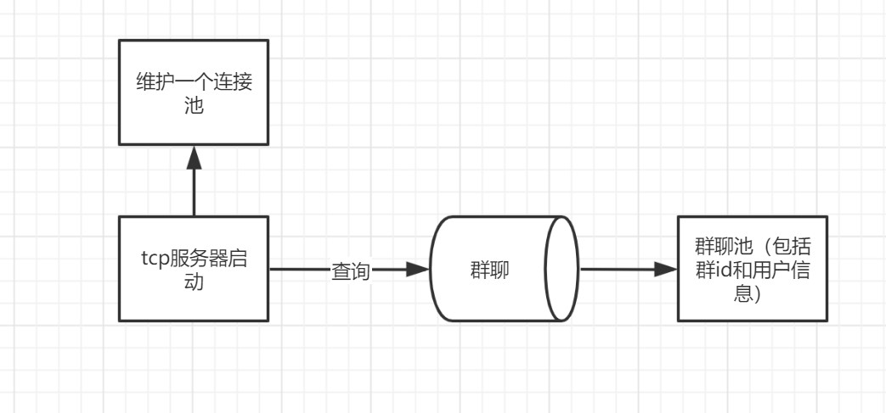
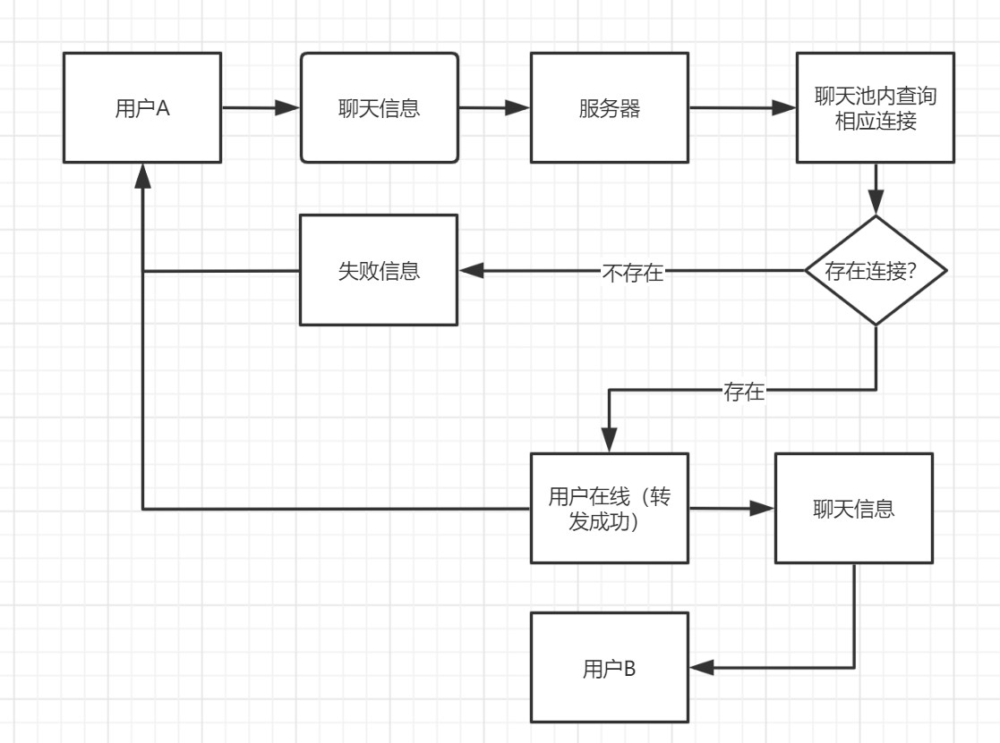
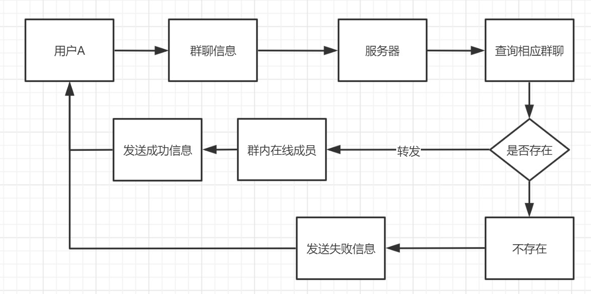

# 演示地址
* 47.114.107.253
# TcpServer
目的：建立一个tcp服务器
# 已实现的功能
* 登录并加入聊天池
* 好友间聊天
* 用户心跳
* token验证
* 添加好友
* 在线情况的修改
* 群聊
# 实现
* 自定义的信息传递结构
# 目前的需求
* 创建群聊时 将群聊加入群聊池
* 添加好友加入群聊

# 启动

## 使用docker
请先在配置文件夹中配置`config.yaml`
```shell
# 构建镜像
docker build -t tcpserver:0.1 .
# 启动镜像
docker run -d \
--rm \
--name tcpserver \
-p4000:4000 \
-p4001:4001 \
tcpserver:0.1
```

## 单元测试

由于没有配置文件 过不了ci所以决定注释掉需要配置文件的测试，本地有配置时测试无误

## 部分功能流程

### 添加好友流程图


### 群聊邀请好友流程图


### 服务器启动流程图


### 用户聊天流程图


### 群聊流程图


